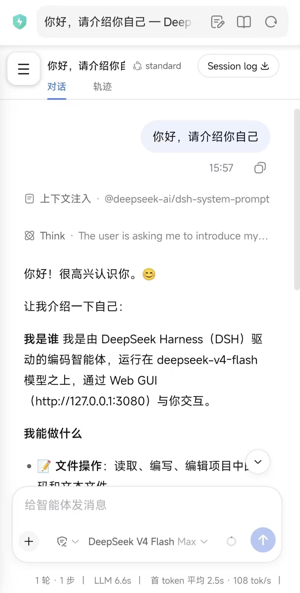
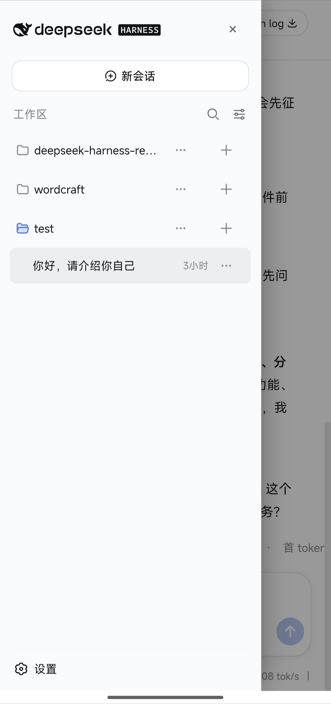

# deepseek-harness-remote

> 🌐 **Language**: English · [中文](README.zh-CN.md)

**Use [DeepSeek Harness](https://github.com/deepseek-ai/deepseek-harness) from any device, anywhere.** Desktop and phone — with a mobile-optimized web UI and a native Android app (APK).

- ✅ **Desktop web access**: `http://127.0.0.1:3080` locally; remotely via Tailscale at `https://<machine>.<tailnet>.ts.net/`
- ✅ **Mobile web adaptation (mobile-fit)**: narrow screens automatically get the mobile layout (drawer navigation, session actions, input experience, full-screen settings, etc.)
- ✅ **APK (native Android shell)**: standalone app icon, zero-dependency WebView container — no browser needed
- ✅ **Remote configuration (optional proxy)**: edit models / plugins / permissions / API keys from the phone

> **Note**: this project **does not modify the dsh source** (a pure overlay). When upstream dsh changes, this project **adapts accordingly**.

> **Compatibility**: this project currently adapts **dsh v0.1.0-rc.8** (updated 2026-08-16). The included APK is already up to date — no rebuild needed.

## Screenshots

  
  &nbsp;&nbsp;
  
   
  Left: mobile web (mobile-fit)&nbsp;&nbsp;Right: mobile APK

## How it works & structure (brief)

**Pure overlay**: no dsh source is touched; we adapt when upstream changes.
Three components:

| Component | One-line principle |
|---|---|
| **mobile-fit** (`mobile-fit/`) | Injects mobile CSS + interaction through the official client-plugin seam (drawer, input, full-screen settings) — active on narrow screens only |
| **APK shell** (`apk/`) | Zero-dependency WebView container: URL + Token on one setup screen, loads the same entry as the phone browser |
| **remote-config proxy** (`scripts/remote-config-proxy.mjs`) | The dsh trust fence decides purely from the Host header — the proxy rewrites it to the loopback spelling and deletes Origin, unlocking configuration on the phone |

Full internals and engineering details: [docs/development.md](docs/development.md).

## Quick start (from zero to remote control)

1. **On the PC** install Node.js (≥22) and make sure `npx @deepseek-ai/dsh web` starts;
2. **Start** dsh web (manual start or autostart — your choice);
3. **Phone access** (optional): Tailscale networking → `tailscale serve` → configure `trustedHosts`;
4. **Mobile UI** (optional): mount the mobile-fit plugin;
5. **APK & config unlock** (optional): install the APK; deploy the remote-config proxy if you want to edit configuration from the phone.

Every step ships with full commands, manual-vs-autostart choices, the token switch and **complete uninstall** steps — **see [docs/tutorial.md](docs/tutorial.md)**.

## Documentation map

| Document | Audience | Content |
|---|---|---|
| [docs/tutorial.md](docs/tutorial.md) · [中文](docs/tutorial.zh-CN.md) | **All users** | From zero to remote control: web + APK, manual/autostart, token switch, uninstall, FAQ |
| [docs/pitfalls.md](docs/pitfalls.md) · [中文](docs/pitfalls.zh-CN.md) | **Developers** | Pitfall log: root causes and fixes for every known issue |
| [docs/development.md](docs/development.md) · [中文](docs/development.zh-CN.md) | **Developers** | Project structure; mobile-fit / APK / proxy internals; tests; contributing |

## Security notes

- Only devices in the same tailnet can reach the service (Tailscale device identity = authentication);
- The dsh `/api` trust fence (`trustedHosts`) prevents DNS rebinding;
- Configuration/credential APIs stay pinned to loopback by default (upstream security design); deploying the remote-config proxy unlocks them on the phone (at your own risk — tutorial section 4);
- **Never** use `tailscale funnel` (it would expose the service to the public internet).

## Contributing

Contributions are welcome! Feel free to open an [issue](https://github.com/joyfish666/deepseek-harness-remote/issues)
or submit a [pull request](https://github.com/joyfish666/deepseek-harness-remote/pulls) —
even the smallest problem report or fix is appreciated.

Before you start developing, please read:

- [docs/pitfalls.md](docs/pitfalls.md) — root causes and fixes for every known issue;
- [docs/development.md](docs/development.md) — project structure and component internals.

House rules: **record every new pitfall in pitfalls immediately**; keep docs
bilingual; scripts delivered to Windows PowerShell 5.1 must be pure ASCII
(pitfalls P1).

## License

[MIT](LICENSE)
